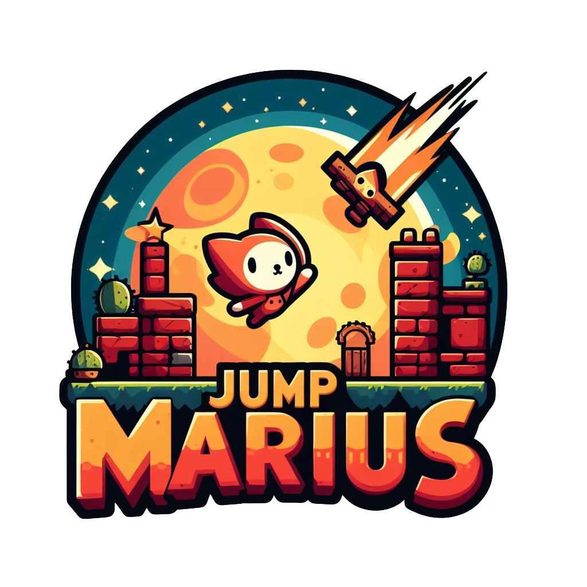
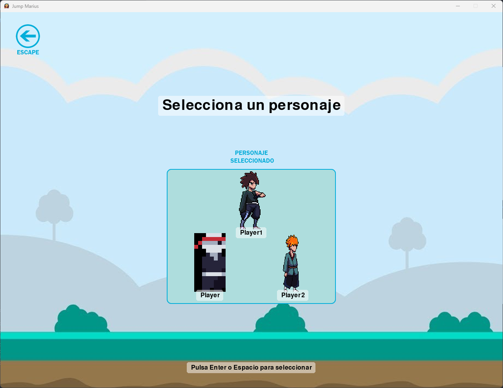
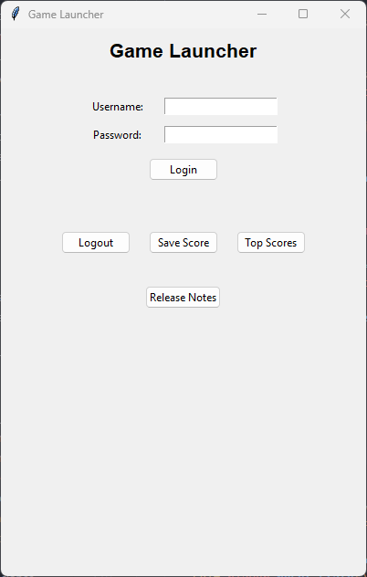
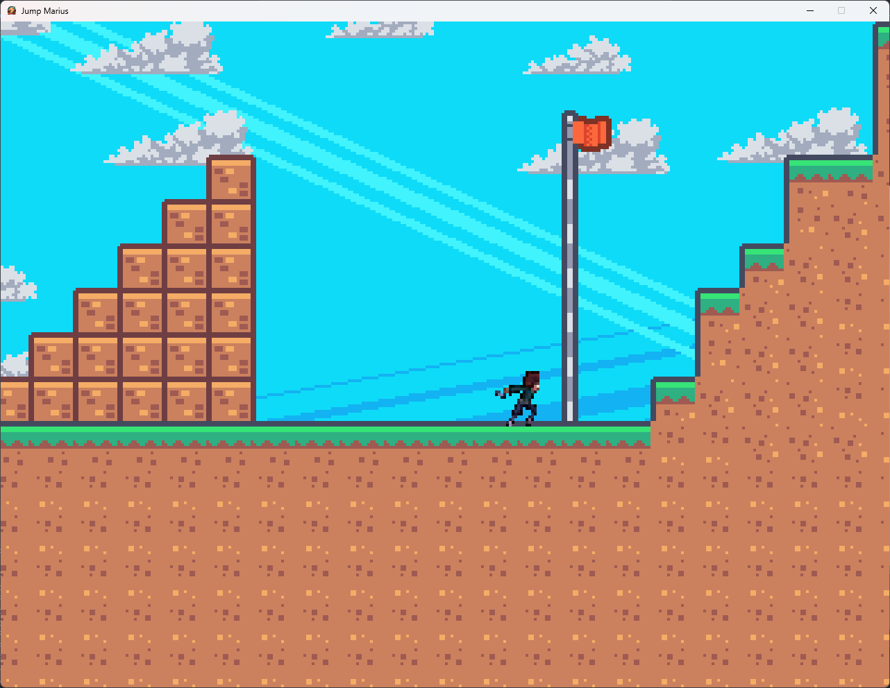

## JUMP MARIUS

  

###   [Español](#español)   |   [ English](#english)

---

## Español 

Jump Marius es un emocionante juego de plataformas creado con Pygame. Únete a Marius en un emocionante viaje a través de diversos niveles llenos de desafíos, enemigos y paisajes impresionantes.

#### **Versión:** 1.0.0

##### Notas de la Versión:
- **Nuevos Mundos:** Ahora, el editor permite guardar directamente el mundo en la carpeta correcta y antes de iniciar cada partida se puede seleccionar en qué mundo comenzar la partida, además que el editor ya contiene nuevos bloques para que crear estos mundos.
- **Menú de selección de personajes:** Implementado un nuevo menú que permite elegir entre 3 de los personajes que se encuentran en el juego.
  

    
  

- **Mejoras Gráficas:** Implementación de los nuevos personajes aunque aún con bugs en la renderización de los mismos dentro de juego.
- **Nuevos Tilesets:** Implementado en el editor 2 nuevos tilesets para poder crear mapas con nuevos bloques.
- **Launcher:** Está creado el launcher que permitirá que tras loguearte se inicie el juego aunque aún no se pueden registrar usuarios y el único usuario es "user" y la contraseña "password."
  

    
  

- **Menú de Configuración:** Nuevo menú de configuración que por el momento solo permite cambiar las dimensiones del juego.
- **Bloque Final:** Hasta ahora, el juego no tenía final; en esta versión, el juego se acabará al tocar un bloque llamado "final," creado como ejemplo o al tocar el palo de la bandera.
  

    
  

- **Scipt de inicio**: Añadido el ejecutable "JumpMarius.bat" que ejecuta el juego directamente.

##### To-Do List:
- Correcto funcionamiento del launcher y todas sus funcionalidades.
- Implementar más niveles y desafíos.
- Añadir opciones de configuración avanzada.
- Mejorar la interfaz de usuario.
- Añadir al menú de configuración la opción de idioma y que el idioma se cambie automáticamente en todos los menús al cambiarlo.

###### Bugs:
- Mala hitbox del personaje principal.
- Los menús secundarios no funcionan correctamente; se queda de fondo la opción que no está marcada.

#### Colaboradores:
Cualquier persona puede colaborar y abrir su pull request para contribuir al desarrollo de Jump Marius. ¡Tu ayuda es bienvenida!

#### Créditos:
 - Introducción a Pygame y primeras funcionalidades del juego: [@DaFluffyPotato](https://twitter.com/DaFluffyPotato)
 - Nuevos tilesets: [Kenney](https://www.kenney.nl/)

---

## English  

Jump Marius is an exciting platformer game created with Pygame. Join Marius on a thrilling journey through various levels filled with challenges, enemies, and stunning landscapes.

#### **Version:** 1.0.0

##### Release Notes:
- **New Worlds:** The editor now allows you to save the world directly to the correct folder, and before starting each game, you can choose which world to start in. The editor also includes new blocks to create these worlds.
- **Character Selection Menu:** Implemented a new menu that allows you to choose from 3 characters in the game.
  

    
  

- **Graphic Improvements:** Implementation of new characters, although there are still rendering bugs in the game.
- **New Tilesets:** Two new tilesets are implemented in the editor to create maps with new blocks.
- **Launcher:** The launcher is created to start the game after logging in, although user registration is not yet possible, and the only user is "user" with the password "password."
  

    
  

- **Configuration Menu:** New configuration menu that currently only allows changing the game's dimensions.
- **Final Block:** Until now, the game had no ending. In this version, the game will end by touching a block called "final," created as an example, or by touching the flagpole.
  

    
  

- **Startup Script**: Added the executable "JumpMarius.bat" that runs the game directly.

##### To-Do List:
- Proper functioning of the launcher and all its features.
- Implement more levels and challenges.
- Add advanced configuration options.
- Improve the user interface.
- Add a language option to the configuration menu and automatically change the language in all menus when changed.

###### Bugs:
- Poor hitbox for the main character.
- Secondary menus do not work correctly; the unselected option remains in the background.

#### Collaborators:
Anyone can collaborate and open a pull request to contribute to the development of Jump Marius. Your help is welcome!

#### Credits:
 - Introduction to Pygame and initial game features: [@DaFluffyPotato](https://twitter.com/DaFluffyPotato)
 - New tilesets: [Kenney](https://www.kenney.nl/)

---
